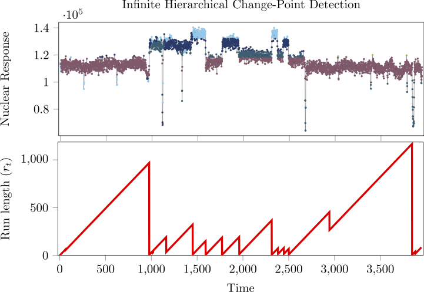
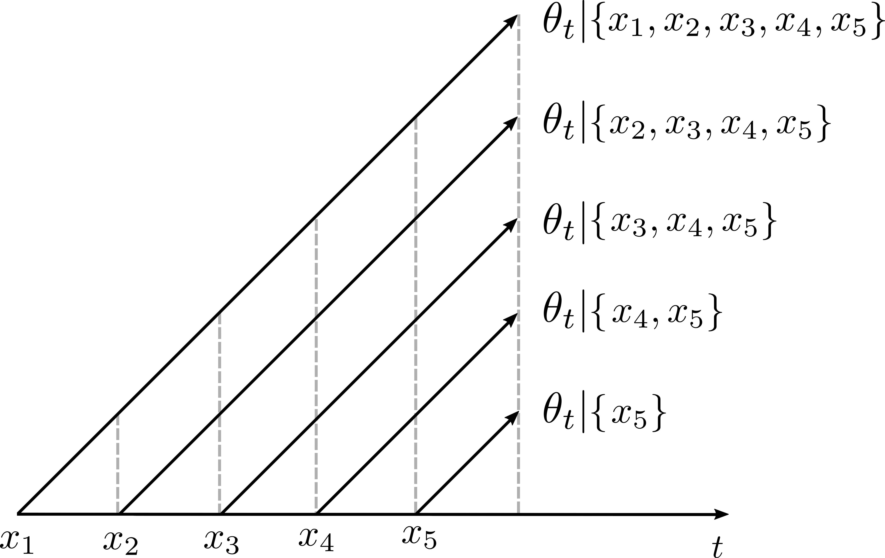

# Continual Learning for Infinite Hierarchical Change-Point Detection

We derive a continual learning mechanism that recursively infers the surrogate latent variable model that we plug in the Bayesian change-point detection method. It is based on the sequential construction of the chinese restaurant process (CRP) and the expectation-maximization (EM) algorithm with stochastic gradient updates.

 

